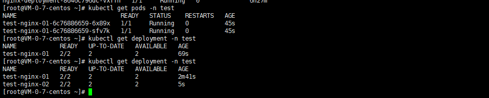
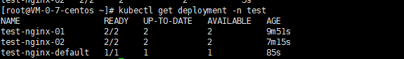
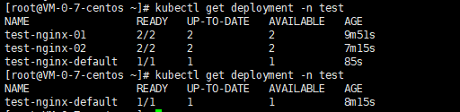

# Testing (测试验证)

## 1. 测试环境 (Environment)
- **OS**: Windows 操作环境 / PowerShell
- **K8s 控制面**: linux服务器上的minikube
- **Go Version**: 1.26.2

## 2. 测试用例验证记录

### TC-01: 使用自定义资源和副本数创建 Pod
* **操作步骤**:
  1. 启动 `server.go` 后台服务。
  2. 运行 `server_test.go` 中配置参数 `Replicas: 2`, `cpu_limit: "300m"` 的 `CreatePod` 单元测试。
  3. 执行 K8s 命令: `kubectl get deploy test-nginx-01 -n test -o yaml`
* **预期结果**:
  - gRPC 返回创建成功。
  - K8s 集群中对应 Namespace 下出现 2 个 Pod。
  - K8s YAML 配置中包含指定的 resource limit 参数。
* **实际结果 (Evidence)**:
  ```text
  === RUN   TestCreatePod_Success
      server_test.go:48: ✅ 测试通过：Deployment 创建成功！
  --- PASS: TestCreatePod_Success (0.83s)
* **状态**: 🟢 Pass
# 服务器结果：在这个NameSpace中名为test中创建了测试deployment


### TC-02: 缺省配额情况测试自动填充默认值
* **操作步骤**:
  1. 在请求参数中去除有关 Replicas 与 Resources 的配置参数（传递空或 0）。
  2. 请求 API 并随后在 k8s 控制台中获取 YAML 配置。
* **预期结果**: 
  - K8s 配置自动填充为 Replicas=1, CPU Limit=200m, Memory Limit=256Mi。
* **实际结果 (Evidence)**:
=== RUN   TestCreatePod_DefaultSettings
    c:/Users/Administrator/Desktop/gostudy/week3/day03/go-rpc/server_test.go:95: ✅ 测试通过：缺省配额 Deployment (test-nginx-default) 创建成功！预期自动回填：1副本, 100m-200m CPU
--- PASS: TestCreatePod_DefaultSettings (0.09s)
* **状态**: 🟢 Pass



### TC-03: 测试删除不存在的 Deployment (异常处理)
* **操作步骤**:
  1. 运行 `server_test.go` 中 `TestDeletePod_NotFound` 单元测试。
  2. 发起参数为删除一个集群中不存在的资源名称的请求。
* **预期结果**:
  - K8s API 拦截并返回 `not found` 错误，阻止继续执行。
  - gRPC 接口正常返回失败状态（Success: false）和错误消息。
* **实际结果 (Evidence)**:
  ```text
  === RUN   TestDeletePod_NotFound
      c:/Users/Administrator/Desktop/gostudy/week3/day03/go-rpc/server_test.go:141: ✅ 测试通过：删除不存在的 Deployment 成功拦截，服务端返回提示：deployments.apps "test-nginx-01" not found
  --- PASS: TestDeletePod_NotFound (0.03s)
  PASS
  ok      go-rpc  0.162s
  ```
* **状态**: 🟢 Pass

### TC-04: 测试删除存在的 Deployment (正常流程)
* **操作步骤**:
  1. 运行 `server_test.go` 中 `TestDeletePod_Success` 单元测试。
  2. 发起参数为删除一个集群中确保存在的 Deployment 资源的请求。
* **预期结果**:
  - K8s API 成功执行删除操作，没有抛出异常。
  - gRPC 接口正常返回成功状态（Success: true）。
* **实际结果 (Evidence)**:
  ```text
  === RUN   TestDeletePod_Success
      c:/Users/Administrator/Desktop/gostudy/week3/day03/go-rpc/server_test.go:118: ✅ 测试通过：存在的 Deployment 删除成功！
  --- PASS: TestDeletePod_Success (0.07s)
  ```
* **状态**: 🟢 Pass

结果：



## 3. 测试结论 (Conclusion)
所有核心功能接口均调通（或者具体记录某些还未验证的点）。本次对 `CreatePod` 关于副本与配额的限制功能升级成功。