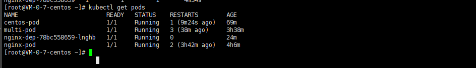
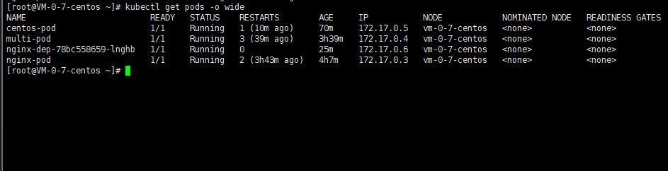
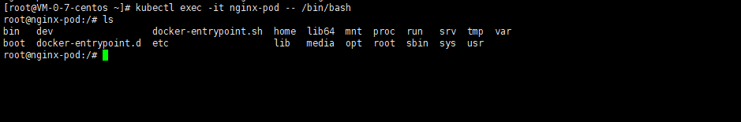
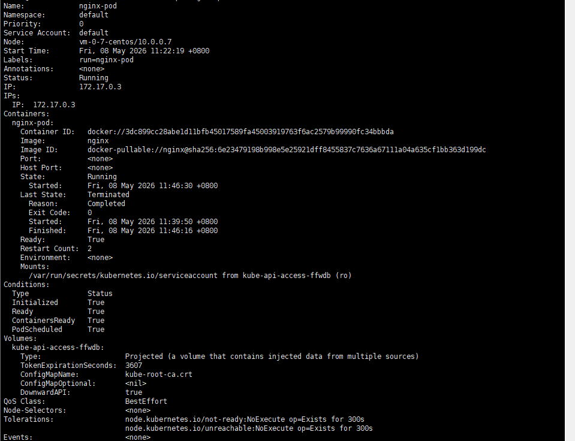
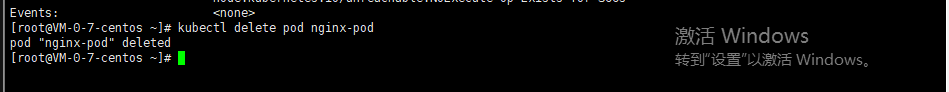

<!-- 这个文件主要展示k8s的基础学习,为之后写一个pod管理平台和operator打下基础-->

<!-- pod的基本命令  使用这个kubectl-->

方式 1：只能在pod中创建一个容器
bash
运行
# 拉取nginx镜像，创建一个Pod
kubectl run nginx-pod --image=nginx

方式2: yaml文件创建pod

1. 查看 Pod
bash
运行
# 查看默认命名空间下的Pod
kubectl get pods

# 查看详细信息（IP、所在节点、镜像）
kubectl get pods -o wide

进入 Pod 内部容器
bash
运行
# 进入Pod内部终端
kubectl exec -it nginx-pod -- /bin/bash

# 进入指定的容器
kubectl exec -it nginx-pod  -c [容器名] -- /bin/bash 

# 退出输入 exit

# 查看容器的信息
运行
kubectl describe pod nginx-pod

# 删除 Pod
运行
kubectl delete pod nginx-pod

# 关于pod的特性：pod可以运行一个到多个的容器，是k8s执行的最小单位.
# pod的网络: 对于同属于一个pod的多个容器，它们同属于一个ip地址（同一个pod的容器之间直接使用locaihost通信），对于不同的pod。它们同属于不同的ip地址，但是同属于一个网段(可以通过这个ip地址通信)
# pod的持久化和文件共享 三种方式:
# emptyDir：临时共享目录，共享文件由pod管理，随pod消亡,
# hostpath:把宿主机的文件挂载到pod中的容器，既可以保证这个数据持久化，同时也能保证容器间进行这个数据共享 缺点:因为pod有可能被调度到其他工作节点，导致数据丢失(数据存放在这个宿主机节点)
# 在多节点中，通常使用这个 ：PV + PVC 持久化存储，也就是可以把一个节点专门用作存储数据或者挂载到云硬盘上，这样不会出现因为转移pod而出现数据丢失
# 流程: PV：集群里提前备好的一块公共存储空间（比如一块云盘、一个 NFS 目录）
<!-- PVC：Pod 向集群申请借用这块空间
流程：
运维先准备好共享存储（云盘 / NFS）
在 K8s 建 PV，绑定这个共享存储地址
Pod 不直接挂存储，只声明要用一个 PVC
K8s 自动把 PVC 绑定到对应 PV
Pod 不管漂移到哪台 Node，自动挂载同一份存储，数据完全不变 -->

# pod的状态管理：
Pending：没调度到节点、镜像拉取中、资源不够
ContainerCreating：正在创建挂载 / 拉容器
CrashLoopBackOff：容器反复崩溃重启（最常见）
Completed：一次性任务跑完正常退出
Terminating：正在删除、优雅终止
Running：容器已经正在运行
ImagePullBackOff：反复拉取镜像

# pod的重启策略
Always：任何退出都自动重启（默认，nginx 这类服务用）
OnFailure：只有异常崩溃才重启，正常执行完不重启
Never：绝不重启

# Pod 资源限制 CPU / 内存
给 Pod 设请求值和上限值：
防止单个 Pod 把服务器 CPU / 内存吃满
集群调度时会根据资源余量分配节点
生产必配，不学只会裸奔跑 Pod。

# 标签 Label + 标签选择器

