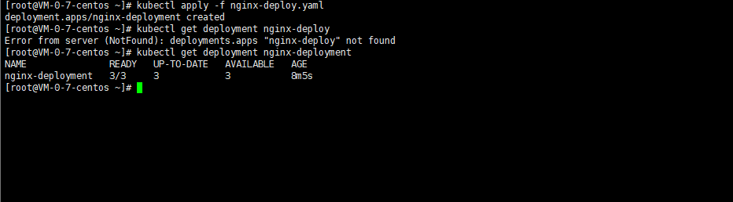
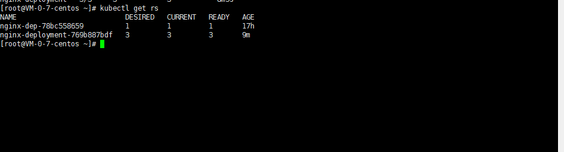
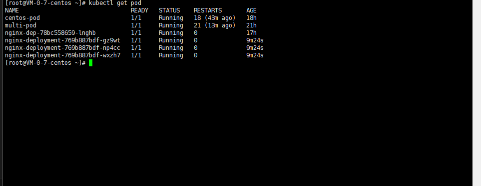
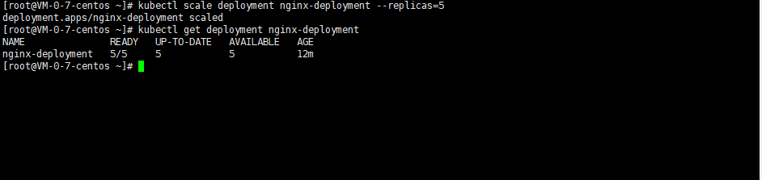
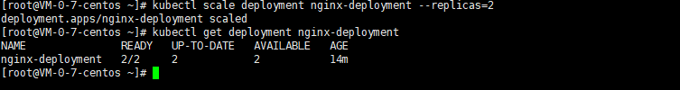
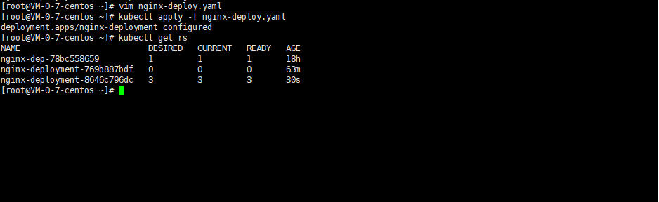
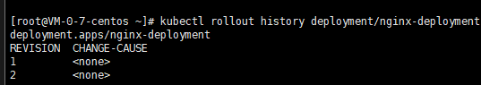
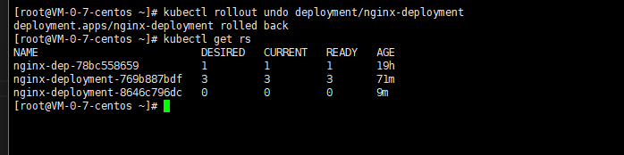
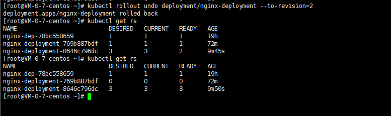
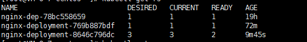

<!-- 这个文件主要是学习这个deployment-->

<!-- 创建的方式:推荐使用这个yaml创建 -->
# K8s API 版本（Deployment 固定用 apps/v1）
apiVersion: apps/v1
# 资源类型：Deployment
kind: Deployment
# 元数据：名称、标签
metadata:
  name: nginx-deployment  # Deployment 名称
  labels:
    app: nginx            # 自定义标签（用于筛选）
# 核心规格
spec:
  replicas: 3             # 期望运行的 Pod 副本数
  selector:               # 标签选择器：匹配哪些 Pod 归我管理
    matchLabels:
      app: nginx
  # Pod 模板
  template:
    metadata:
      labels:
        app: nginx       # Pod 的标签（必须和 selector 匹配）
    spec:
      containers:        # 容器配置
      - name: nginx      # 容器名称
        image: nginx:1.23  # 容器镜像（指定版本，避免 latest）
        ports:
        - containerPort: 80  # 容器暴露的端口

# 应用配置文件，创建资源
kubectl apply -f nginx-deploy.yaml

# 1. 查看 Deployment
kubectl get deploy

# 2. 查看 ReplicaSet
kubectl get rs

# 3. 查看 Pod
kubectl get pod

# 关于这个deployment是如何实现：自动扩容，缩容，滚动滚新，回滚操作的?

# 扩容到 5 个 Pod
kubectl scale deployment nginx-deployment --replicas=5

# 缩容到2个
kubectl scale deployment nginx-deployment --replicas=2

# 更推荐的做法是通过这个yaml文件重新声明,重新运行.
# 底层原理是什么：是由谁去管理这个pod的添加与缩减? 答:是由一组组件去完成这件事:
Deployment Controller	kube-controller-manager	指令同步者	监听 Deployment 变化，将 replicas 同步到对应的 ReplicaSet
ReplicaSet Controller   对比 “期望副本数” 和 “当前副本数”，直接创建 / 删除 Pod 对象(注意:只是创建，调度的工作并不是由其执行的)
kube-scheduler	        pod调度为新创建的 Pending 状态 Pod 分配节点(一个k8s集群中存在多个工作节点,会根据这个每个的节点的资源去调度这个pod)kubelet	               每个节点上的代理Pod 生命周期管理者，启动新 Pod 的容器，执行缩容时的优雅终止

# 滚动更新 ：要学习这个滚动更新:先得学习这个 ReplicaSet，一个dp可能对应着多个ReplicaSet，从版本上理解: 1 个 ReplicaSet（RS）就对应 Deployment 的 1 个版本,当前的是正在活跃的
本质是新旧两个 ReplicaSet 的「协同扩缩容」：
新 ReplicaSet：副本数从 0 逐步增加到期望数（比如 3）
旧 ReplicaSet：副本数从 3 逐步减少到 0
过程中始终保持「可用 Pod 数 ≥ 期望数 - 允许不可用数」，不会出现服务中断

# 修改 nginx-deploy.yaml 中的 image: nginx:1.23 → nginx:1.25
kubectl apply -f nginx-deploy.yaml

# 如果一个ReplicaSet对应着一个版本，我们如何查询和回滚
kubectl rollout history deployment/nginx-deployment

# 回滚上一个或者指定的版本:
kubectl rollout undo deployment/nginx-deployment

# 回滚到指定版本（比如回滚到 Revision 2）
kubectl rollout undo deployment/nginx-deployment --to-revision=2

# 关于这个maxSurge 和 maxUnavailable

用当前的replicas: 3 来算，默认参数下的更新节奏是：
maxSurge: 25% → 向上取整为 1 → 最多允许同时存在 3 + 1 = 4 个 Pod（旧 + 新）
maxUnavailable: 25% → 向下取整为 0 → 最少要保持 3 - 0 = 3 个可用 Pod
更新时的顺序是：
先启动 1 个新 Pod（此时旧 3 + 新 1 = 4，不超过 maxSurge）
等新 Pod 就绪后，删除 1 个旧 Pod（此时旧 2 + 新 1 = 3，可用数始终为 3）
再启动第 2 个新 Pod → 就绪后删除第 2 个旧 Pod
再启动第 3 个新 Pod → 就绪后删除最后 1 个旧 Pod
最终所有 Pod 都是新版本，旧 ReplicaSet 的副本数降为 0

